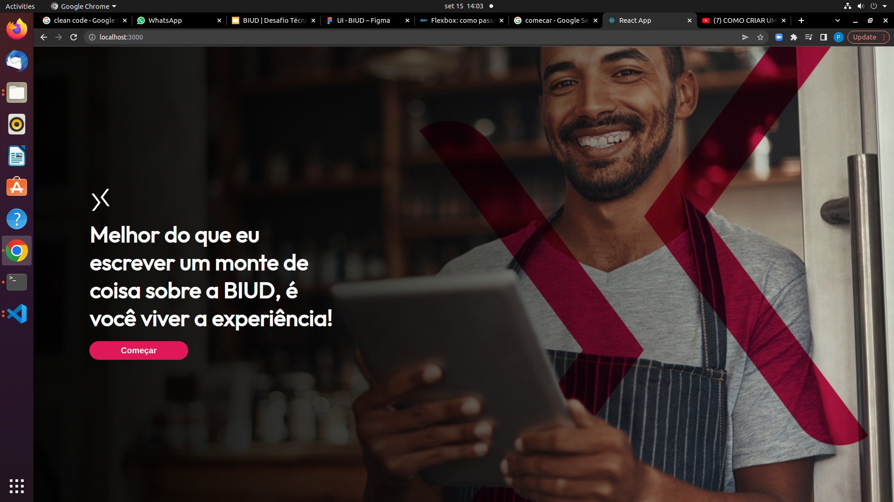
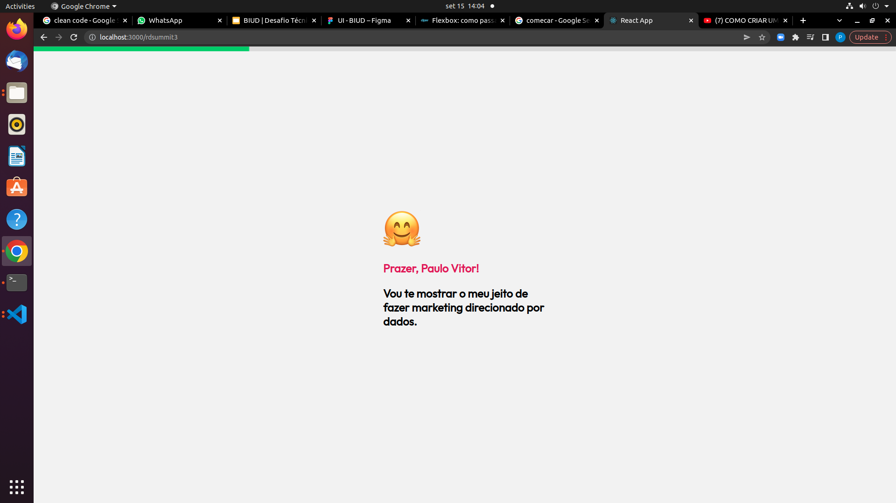
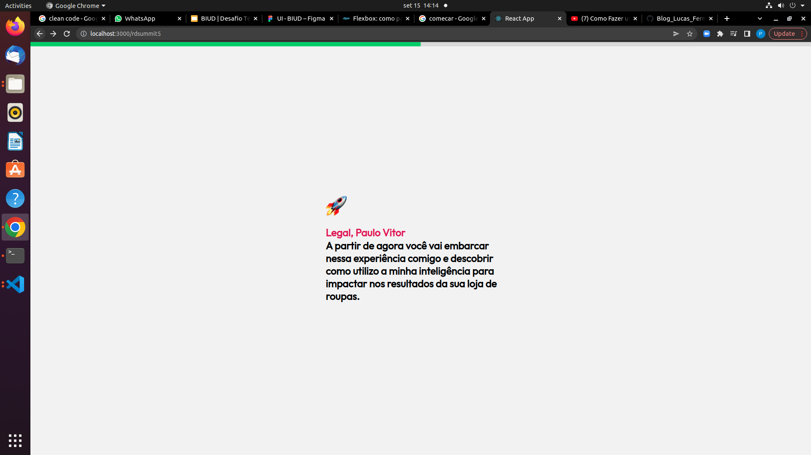
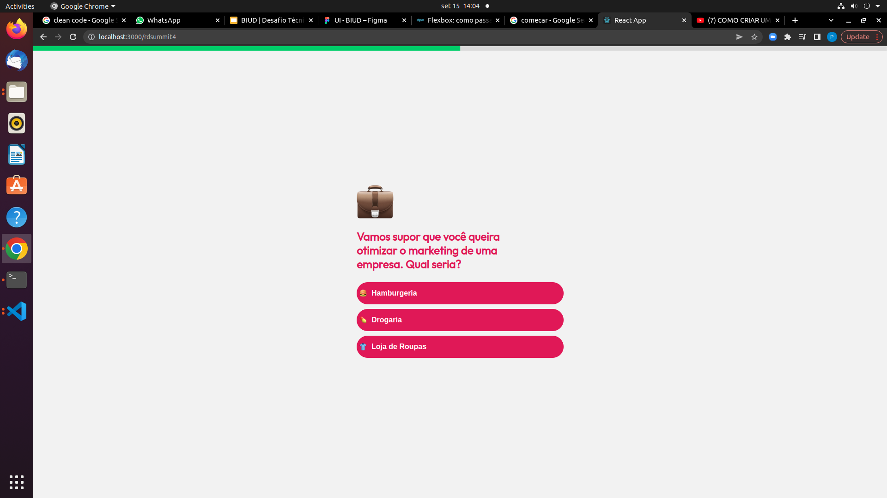
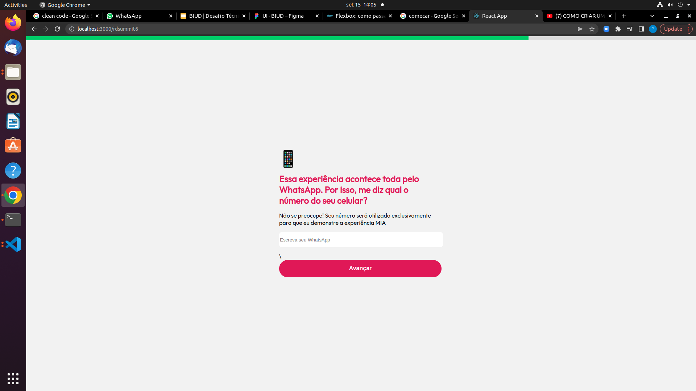
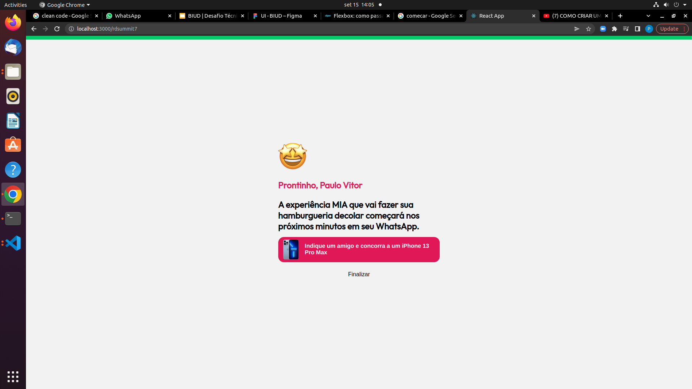

<h1 align="center">
  
 <p>Teste BIUD</p>
</h1>

## Como acessar 
 ```bash
 #Clone o projeto
 $git clone https://github.com/pv209/BIUD-TESTE.git

 ```bash
 # entre no diretorio
 $ cd teste-biud

 ```bash
 #instalar dependencias
 $ npm install
<p>ou</p>

 ```bash
 #instalar dependencias
 $ yarn  install

##Imagens do Projeto















## Lembrando que

<p>O projeto foi feito para ser responsivo e funciona em varios tamanhos de tela</p>